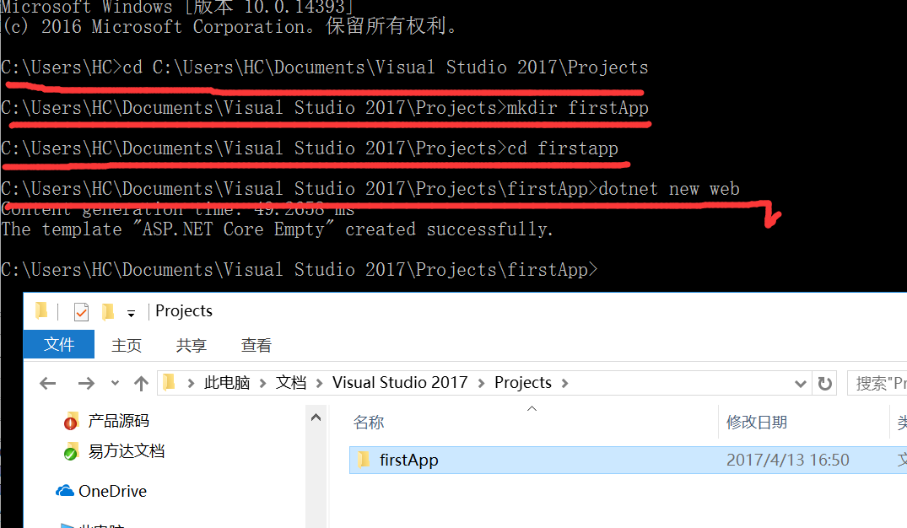
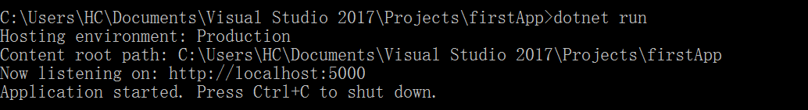
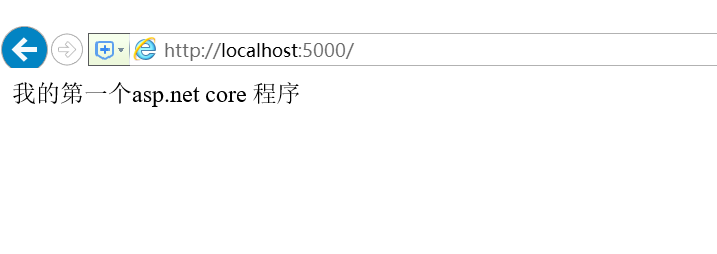

###  一、创建项目

```
cd C:\Users\HC\Documents\Visual Studio 2017\Projects
mkdir firstApp
cd firstapp
dotnet new web
```



### 二、发布程序

打开**Startup.cs**修改

```
app.Run(async (context) =>
            {
                await context.Response.WriteAsync("我的第一个asp.net core 程序");
            });
```

然后在控制台 输入:

```
dotnet run
```



最后在浏览器地址栏输入 http://localhost:5000



好了，第一个asp.net 程序跑起来了！！！


