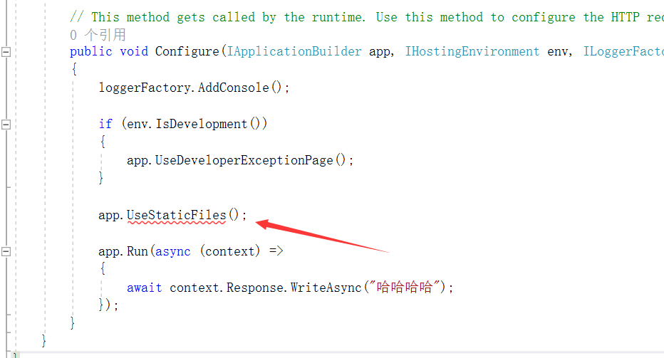
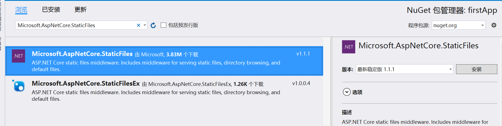
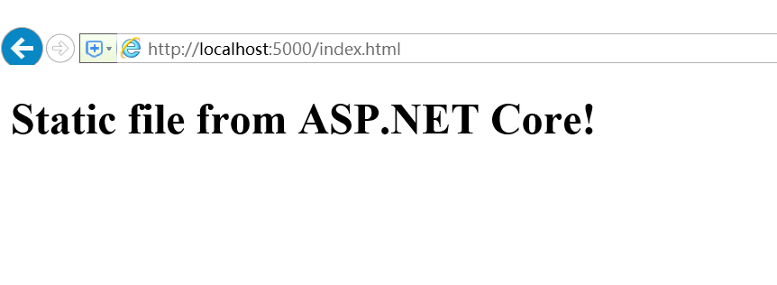
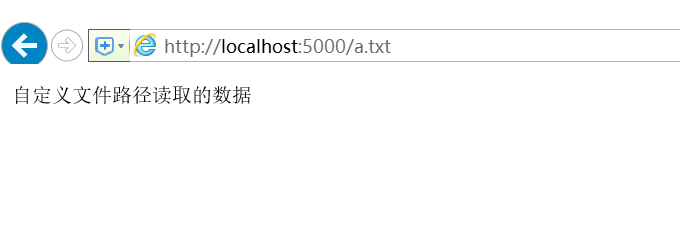

#  文件中间件的使用(firstApp)

### 一、在默认文件夹创建文件

在项目目录->wwwroot->创建一个index.html

```
<!DOCTYPE html>
<html>
<body>
    <h1>Static file from ASP.NET Core!</h1>
</body>
</html>
```

在Startup.cs中添加:

````
app.UseStaticFiles();
````

注意:此时代码提示报错,因为没有引用。




在NuGet中添加**Microsoft.AspNetCore.StaticFiles**




然后,启动生成，并且启动项目




### 二、自定义文件路径

替换之前的app.UseStaticFiles()为

```
using Microsoft.Extensions.FileProviders;

var staticfile = new StaticFileOptions();
            staticfile.FileProvider = new PhysicalFileProvider(@"D:\");//指定目录 可以是任何的地址
            app.UseStaticFiles(staticfile);
```

然后再D盘下面新建一个a.txt 并且写入"自定义文件路径读取的数据"

重新生成、并且启动项目

