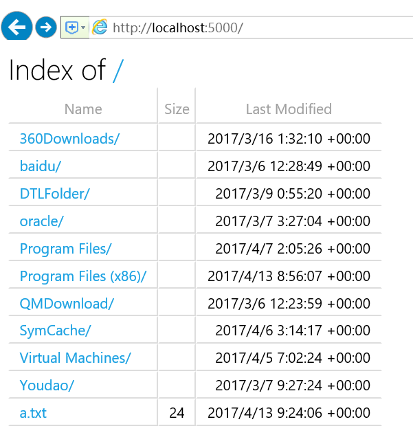
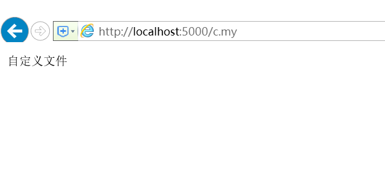

# 使用UseDirectoryBrowser 实现文件服务器(firstApp)


在Startup.cs的 Configure方法中添加

```
var dir = new DirectoryBrowserOptions();
            dir.FileProvider= new PhysicalFileProvider(@"D:\");
            app.UseDirectoryBrowser(dir);
            var staticfile = new StaticFileOptions();
            staticfile.FileProvider = new PhysicalFileProvider(@"D:\");            
            app.UseStaticFiles(staticfile);
```

**StaticFiles**提供了简便的写法

```
app.UseFileServer(new FileServerOptions()
            {
                FileProvider = new PhysicalFileProvider(@"D:\"),
                EnableDirectoryBrowsing = true
            });
```


生成，启动项目:



然而有的文件是可以直接打开的,有的却显示打开失败,这是因为MIME 没有识别出来。我们可以手动设置这些 MIME 

修改上面的代码为:

```
var staticfile = new StaticFileOptions();
            staticfile.FileProvider = new PhysicalFileProvider(@"D:\");
            staticfile.ServeUnknownFileTypes = true;
            staticfile.DefaultContentType = "application/x-msdownload"; //设置默认  MIME 

            app.UseFileServer(new FileServerOptions()
            {
                FileProvider = new PhysicalFileProvider(@"D:\"),
                EnableDirectoryBrowsing = true
            });
            app.UseStaticFiles(staticfile);
```


D盘中,新增一个b.log的文件,并且写入“log文件”，此时再去点击b.log的文件,

浏览器会先下载该文件,然后再打开


对于特别的类型的文件,可以单独来设置。在D盘新建一个c.my的文件,并且写入"自定义文件".然后再上面的代码中添加

```
var provider = new FileExtensionContentTypeProvider();
            provider.Mappings.Add(".my", "text/plain");//手动设置对应MIME
            staticfile.ContentTypeProvider = provider;
```

生成,启动,显示c.my格式的文件是以txt的方法打开显示的



不同类型的文件，可以设置多个!!!